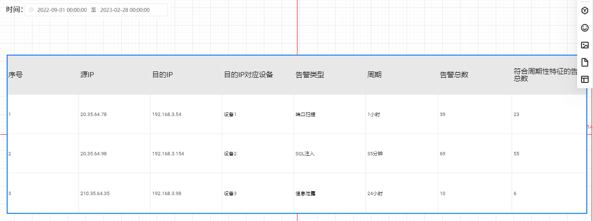

[](https://forthebadge.com)


[](https://forthebadge.com)

[](https://github.com/gwyxjtu)

## **0. 代码功能解释**
本代码负责根据系统的累计外购电量，计算系统的累计碳排放量。

## **1. 代码环境**
 
```
Python==3.9.3
pandas==2.1.1
numpy==1.20.3
pandas==1.2.4
pymysql==1.1.0
datetime==5.3
logging==0.4.9.6
```

- 搭环境的话请按照目录下的requirements.txt 进行安装
```pip install -r requirements.txt```
## **2. demo示例**
- 注：运行代码如下   
``` python main.py```   

## 输入：
直接从数据库对应表中获取告警日志数据

## 输出文件
写入数据库对应表中：源IP，目的IP，告警类型，告警设备，周期，告警总数，符合周期性特征的告警总数


## **3.输入数据**

- 设备配置文件在文件夹下的`config.py`，由管理员进行配置。
- 直接从数据库对应表中获取告警日志数据

## **4.输出数据**

- 输出计算数据至数据库对应表中，如下：
  
|     | 计算时间     | 源IP | 目的IP          | 告警类型 | 告警设备厂商 | 告警周期 | 告警总数 | 符合周期性特征的告警总数 |
|-----|----------|-----|---------------|------|--------|------|------|--------------|
| 0   | 2021-09-28 15:41:20 |  202.169.247.61   | 20.11.112.57  | 防爬虫  | 外网xxx  | 1    | 135  | 52           |
| 1   | 2021-09-28 12:20:04 |  202.169.214.248   | 202.169.128.140 | 信息泄露 | 外网xxx  | 1    | 130  | 60           |
| 2   | 2021-09-28 10:34:41 | 202.169.48.151    | 202.169.30.122 | 注入攻击 | 外网xxx  | 600  | 100  | 65           |
| 3   | 2021-09-28 01:41:39 |  202.169.247.187   | 20.11.112.77  | 信息泄露 | 外网xxx  | 10   | 90   | 40           |
| ... | ...      |     |               |      |        |      |      |              |


## **5.代码所支撑的前端页面图或表**


## **6. 代码目录**

```
告警周期性模型
├─ logfile
│  └─ log.txt
├─ main.py
├─ sql.py
├─ config.py
├─ TimeseriesPeriodic.py
├─ readme.md
└─ requirements.txt

```
